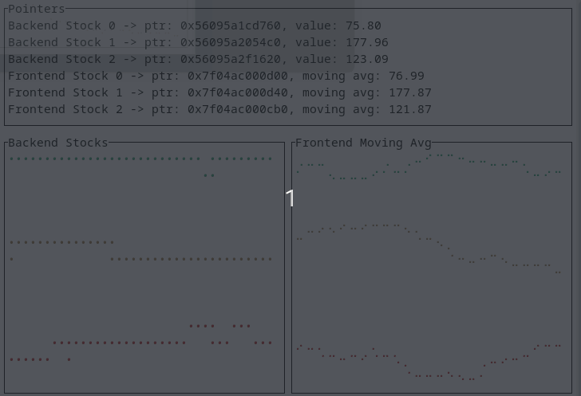

# 1️⃣ About

Uses Rust Ownership capability and integrates PostgreSQL to visualize and store stock values in the DB.

<p align="center">
  
</p>


# 1️⃣ Dependencies Installation

## Rust
```bash
curl --proto '=https' --tlsv1.2 -sSf https://sh.rustup.rs | sh
source $HOME/.cargo/env
rustc --version
cargo --version
```
## PostgreSQL system packages

```bash
sudo apt update
sudo apt install -y postgresql postgresql-contrib libpq-dev
```

# 2️⃣ Start backend 
```bash
cargo run
```

# 3️⃣ Initiate postgres 
```bash
 sudo -i -u postgres
```
## Create user and database
```bash
CREATE DATABASE hft;
CREATE USER postgres WITH PASSWORD 'test';
```

# 4️⃣ Connect to 'hft' Database 
When asked, password = ´test´
```bash
psql -h localhost -U postgres -d hft
```
## Check status
```bash
sudo systemctl status postgresql
```

## Create table

```bash
 CREATE TABLE stock_data (
    id SERIAL PRIMARY KEY,
    stock_id INT NOT NULL,
    price REAL NOT NULL,
    ts TIMESTAMP NOT NULL
```
### Check created table
```bash
 \d stock_data
```
# 5️⃣ Get latest stock updates
```bash
SELECT * FROM stock_data ORDER BY ts DESC LIMIT 20;
```

